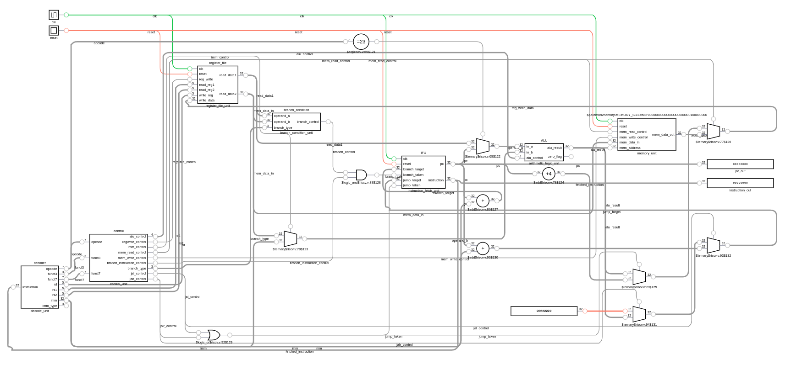

# RISCV-32

## Characteristics
- Modified Harvard Architecture (Three memory sources)
- single cycle  

## notes
- due to details in the instruction_fetch.v (IFU), instruction should be loaded from the [1] index not the [0] index.

### ref
https://riscv.org/wp-content/uploads/2017/05/riscv-spec-v2.2.pdf
https://www.cs.sfu.ca/~ashriram/Courses/CS295/assets/notebooks/RISCV/RISCV_CARD.pdf
https://luplab.gitlab.io/rvcodecjs/#q=add+x1,+x0,+x0&abi=false&isa=AUTO
https://passlab.github.io/CSE564/notes/lecture08_RISCV_Impl.pdf
https://www.cs.cornell.edu/courses/cs3410/2019sp/schedule/slides/06-cpu-pre.pdf
https://en.wikichip.org/wiki/risc-v/registers

## block diagram of the architecture
generated using digitaljs

